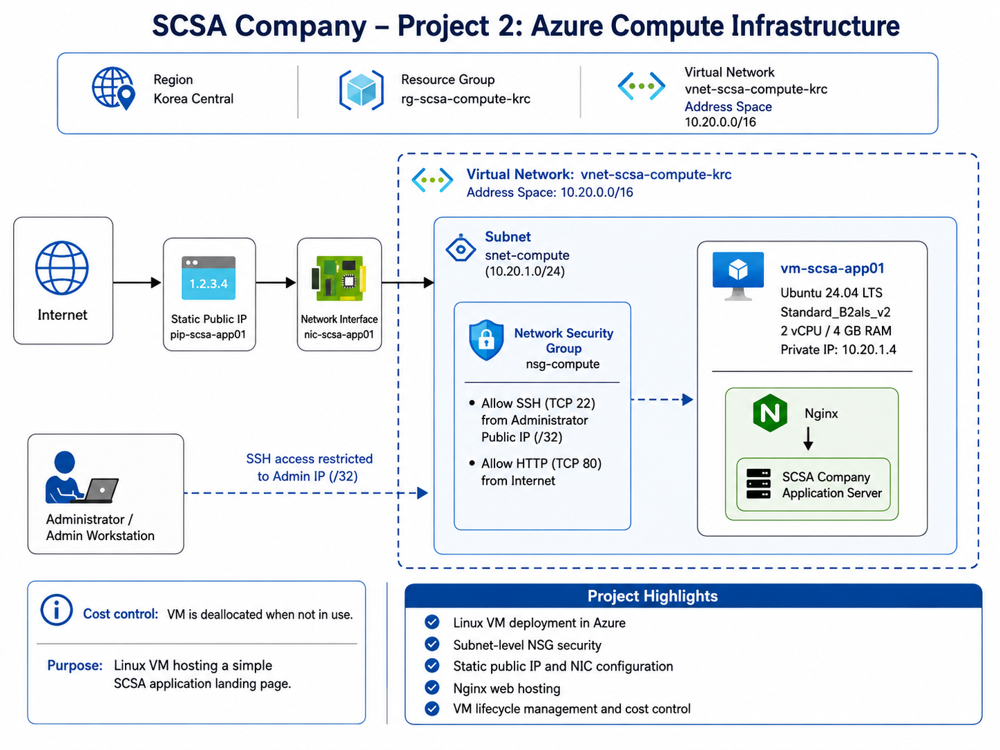

# SCSA Company – Project 2: Azure Compute Infrastructure

## Project Overview

This project demonstrates the deployment and administration of an Azure Linux compute environment for SCSA Company.

The environment includes a Linux virtual machine, dedicated networking, subnet-level security controls, a static public IP, Nginx web hosting, and VM lifecycle management.

The project was designed with realistic operational and cost constraints rather than simply using the cheapest available configuration.

## Business Scenario

SCSA Company requires a small Azure-hosted application server that can support a lightweight web workload.

The server must:

- Run on a properly sized Linux virtual machine
- Use a dedicated Azure virtual network and subnet
- Restrict administrative SSH access
- Allow HTTP access to the hosted application
- Support repeatable deployment through Azure CLI
- Demonstrate VM lifecycle and cost-control operations

## Architecture Diagram

## Deployment Region Decision

The original deployment target was Southeast Asia to align with SCSA Company's existing Azure network foundation from Project 1.

However, the subscription did not provide access to appropriately sized low-cost general-purpose VM SKUs in Southeast Asia.

Rather than deploying a significantly oversized or specialized VM, SKU availability was validated across supported Azure regions.

Korea Central was selected because it provided access to a suitable general-purpose burstable VM size while maintaining reasonable geographic proximity to the Philippines.

Because Azure virtual networks are regional resources, Project 2 uses a separate Korea Central VNet rather than attaching the VM directly to the Southeast Asia network created in Project 1.

## Compute Sizing Decision

The VM was intentionally sized using a minimum operational requirement rather than selecting the smallest possible SKU.

### Selected VM Size

`Standard_B2als_v2`

Resources:

- 2 vCPUs
- 4 GB RAM
- x64 architecture
- Premium disk support
- Accelerated networking support
- Up to 4 data disks

The 4 GB RAM requirement was selected to provide sufficient capacity for:

- Ubuntu Server
- System updates
- Nginx
- Monitoring agents
- Basic application workloads
- Administrative operations

## Azure Region

- Korea Central

## Resource Group

- `rg-scsa-compute-krc`

## Virtual Network

- Name: `vnet-scsa-compute-krc`
- Address space: `10.20.0.0/16`

## Subnet

| Subnet | Address Space | Purpose |
|---|---|---|
| `snet-compute` | `10.20.1.0/24` | Application and compute workloads |

## Network Security

### Network Security Group

`nsg-compute`

The NSG is associated with the compute subnet.

### Inbound Rules

| Rule | Priority | Protocol | Port | Source | Access |
|---|---:|---|---:|---|---|
| `Allow-SSH-MyPublicIP` | 100 | TCP | 22 | Administrator public IP `/32` | Allow |
| `Allow-HTTP-Internet` | 110 | TCP | 80 | Internet | Allow |

Administrative SSH access is restricted to a single administrator public IP using a `/32` source prefix.

The actual administrator IP is intentionally not included in this repository.

## Public IP

A Standard static public IP was created for the application server:

- `pip-scsa-app01`

A static address was used so the application endpoint remains consistent across VM restart and deallocation cycles.

## Network Interface

- `nic-scsa-app01`

The NIC connects the VM to:

- `vnet-scsa-compute-krc`
- `snet-compute`

The deployed private IP was:

- `10.20.1.4`

## Linux Virtual Machine

### VM

- Name: `vm-scsa-app01`
- Operating system: Ubuntu Server 24.04 LTS
- Size: `Standard_B2als_v2`
- vCPU: 2
- Memory: 4 GB
- Authentication: SSH key

The VM was deployed using Azure CLI and an existing NIC rather than allowing Azure to automatically create all networking resources.

This provides greater visibility and control over the infrastructure components.

## Operating System Validation

After deployment, the server was accessed using SSH.

The following items were validated:

- Hostname
- Ubuntu release
- Available memory
- Remote administrative access

The server reported approximately 3.8 GiB of usable memory, which is expected for a VM provisioned with 4 GB RAM.

## Application Workload

Nginx was installed on the VM to provide a lightweight web workload.

The default Nginx page was replaced with a custom SCSA Company application landing page.

The application displays:

- SCSA Company Application Server
- Azure Compute Infrastructure – Project 2
- VM hostname

The application was validated both locally from the Linux server and externally through the VM public endpoint.

## VM Lifecycle Management

The VM lifecycle was tested using Azure CLI.

Operations included:

- Checking VM instance status
- Deallocating the VM
- Verifying the deallocated state
- Starting the VM
- Confirming the application became available again
- Deallocating the VM after testing

This demonstrates operational administration as well as cost awareness.

When the VM is deallocated, Azure compute allocation is released and compute charges stop, although persistent resources such as disks and public IP resources may still incur charges.

## Troubleshooting

During the initial deployment attempt, the first Ubuntu Marketplace image reference returned:

`VMImage was not found`

The deployment was corrected by validating and using the supported Ubuntu Server 24.04 LTS Marketplace image reference.

This demonstrates the importance of validating current image availability rather than assuming an image URN is universally available.

## Implementation

The infrastructure was deployed using Azure CLI scripts.

### Deployment Scripts

- [01-resource-group.sh](./scripts/01-resource-group.sh) – Creates the Korea Central compute resource group.
- [02-networking.sh](./scripts/02-networking.sh) – Creates the compute VNet and subnet.
- [03-security.sh](./scripts/03-security.sh) – Creates the NSG, configures SSH and HTTP rules, and associates the NSG with the subnet.
- [04-public-ip-nic.sh](./scripts/04-public-ip-nic.sh) – Creates the static public IP and VM network interface.
- [05-linux-vm.sh](./scripts/05-linux-vm.sh) – Deploys the Ubuntu Linux virtual machine.
- [06-vm-lifecycle.sh](./scripts/06-vm-lifecycle.sh) – Demonstrates VM status, deallocation, and startup operations.

## Implementation Evidence

Detailed deployment and validation screenshots are available in the [`screenshots`](./screenshots/) directory.

Evidence includes:

- Compute resource group
- Virtual network and subnet
- SSH NSG rule
- Static public IP
- Network interface
- Linux VM deployment
- Linux OS validation
- Nginx service validation
- Final NSG rules
- SCSA web application
- VM operational state
- VM deallocation
- Azure portal deallocated state

## Security Design

The project demonstrates several security principles:

- Dedicated compute subnet
- Subnet-level NSG protection
- SSH restricted to administrator `/32`
- No unrestricted Internet SSH access
- Explicit HTTP exposure for the web workload
- SSH key authentication
- Separation of networking and compute resources

## Cost Management

Cost management was included as an architectural requirement.

The environment uses:

- A modest 2-vCPU / 4-GB burstable VM
- VM deallocation when not actively being used
- Explicit SKU availability checks before deployment
- Avoidance of oversized or specialized compute SKUs

The VM is kept in a deallocated state when not required for testing.

## Skills Demonstrated

- Azure Virtual Machines
- Linux administration
- Azure Virtual Networks
- Azure Subnets
- Network Security Groups
- Public IP management
- Network Interface management
- SSH administration
- Azure CLI
- Nginx configuration
- Web server deployment
- VM lifecycle management
- Azure cost control
- Azure troubleshooting
- Infrastructure documentation

## Project Status

**Completed**

The Azure compute environment was successfully deployed, secured, validated, tested, and placed into a cost-controlled deallocated state.

This project builds on the SCSA Company network foundation created in Project 1 and establishes the compute layer for future Azure workloads.
